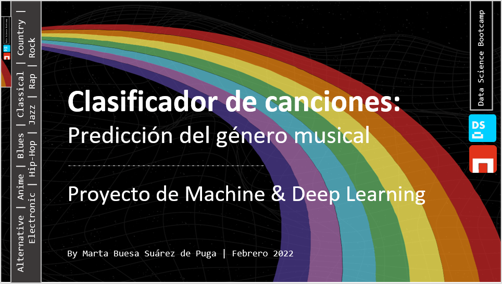

# Machine and Deep Learning Project
Entregable del Bootcamp en Data Science en The Bridge | Digital Talent Accelerator (Madrid, SPAIN)

### Objetivo
Obtener un clasificador del género musical atendiendo a criterios específicamente musicales de una canción como pueden ser la escala musical, el tempo, su ritmo, instrumentación, armonía...

Para ello, se parte de una BBDD con 50000 registros de canciones, con 17 features, variables independientes y 1 target, variable a predecir el género musical que contiene 10 géneros musicales.

Se inicia el trabajo con un Exploratory Data Analysis muy detallado para entender las variables que describen las canciones, se hace Data Wrangling, & Feature Engineering y se preparan lso datos para después desarrollar modelos de Machine Learning con Aprendizaje Supervisado, habiendo utilizado 8 algoritmos diferentes.

Asimismo, también se ha aplicado Deep Learning, una red neuronal basada en el algoritmo MultiLabel Perceptron Classifier con 3 funciones en base a diferentes funciones de activación, optimizadores y capas de neuronas.

### Modelos de Machine Learning & Deep Learning desarrollados:
1. Logistic Regression
2. Decission Tree
3. SVM - Support Vector Machine
4. Ensemble: Random Forest, Logistic Regression & SVM
5. Ensemble: Random Forest
6. Adaptive Boosting
7. Gradient Boosting
8. Extreme Gradient Boosting
9. Red Neuronal: MultiLayer Perceptron Classifier

### Recursos utilizados
1. Lenguaje de programación -> Python 3.7.4.

2. Librerias:
     * Numpy: especializada en el cálculo numérico y el análisis de datos, especialmente para un gran volumen de datos.
     * Pandas: especializada en el manejo y análisis de estructuras de datos.
     * Matplotlib: especializada en la creación de gráficos.
     * Seaborn: especializada en la creación de gráficos basada en matplotlib pero con una interfaz evolucionada que permite generar fácilmente elegantes gráficos.
     * Scikit‑learn: biblioteca para aprendizaje automático de software libre para el lenguaje de programación Python.
     * Keras: biblioteca de Redes Neuronales de Código Abierto escrita en Python.
     * TensorFlow: biblioteca de código abierto para aprendizaje automático a través de un rango de tareas

3. Jupiter Notebooks con Visual Studio Code.

4. Power Point para explicar el detalle los modelos de Machine & Deep Learning desarrollados

### Autora del Proyecto Machine & Deep Learning
 Marta Buesa
 
### Presentación
https://speakerdeck.com/tukibuesa/martabuesa-proyecto-ml-pptcompleta 
